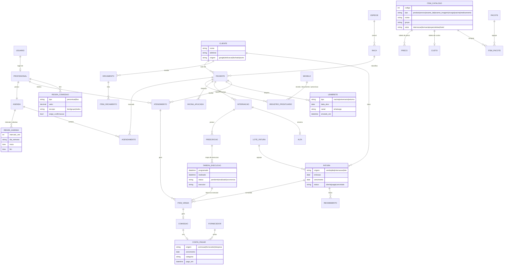

# Recriação do Software de Gestão da Alchemypet — Mapeamento para Orçamento (Fase 1)

> Status: **Mapeamento / Escopo para orçamento** — sem implementação nesta etapa.
> Fonte: transcrição da reunião de *walkthrough* do software de gestão em uso hoje na
> Alchemypet, percorrido de **Home até Internação**, mais os prints dos menus **Financeiro** e
> **Faturamento** e as respostas às perguntas em aberto (§9). O **cadastro de clientes/pacientes**
> foi fechado na reunião anterior e não está nesta transcrição (pré-requisito em §4, E2).
> Data: 2026-09-02 (revisão 2)

---

## 1. Contexto

A **Alchemypet** é um laboratório de análises clínicas veterinárias. A ideia é **recriar, de
forma simplificada e AI-First, o software de gestão que a Alchemypet usa hoje** (agenda,
atendimento, vendas, comissões, cadastros, internação, financeiro, faturamento…), como núcleo
do **Alchemypet Integrado** — a linha *Sistema Integrado / Gestão de Clínicas* do
[mapa de módulos do escopo geral](ESCOPO-ORCAMENTO.md#4-mapa-de-módulos-construir--integrar).
Por ser white-label, o mesmo produto poderá ser revendido a clínicas e hospitais depois.

**Não vamos recriar o software inteiro.** Entra na Fase 1 o que foi percorrido na reunião
(Home → Internação) mais **Financeiro e Faturamento**, incluídos a partir dos prints dos menus
(§3.9 e §3.10). Estoque e Relatórios aparecem no menu, mas ainda não foram percorridos e ficam
para a próxima reunião (§10).

> Nota: o escopo geral previa *integrar* um ERP/financeiro existente. Como o financeiro faz
> parte do software que está sendo substituído, na Fase 1 ele é **construído** (E11 e E14).

### 1.1 Diagnóstico do software atual (repetido ao longo da reunião)

- Arquitetura antiga ("feito em meados dos anos 2000"): navegação que abre janela em cima de
  janela, botões que não fazem nada, tela que trava depois de criar usuário.
- Relatórios redundantes: a mesma análise em três ou quatro telas (lista de vendas, consulta de
  vendas, minhas vendas, resumo total, vendas por grupo…).
- Funcionalidade no módulo errado: saldo devedor do cliente em Vendas, produtividade fora de
  Vendas, "consultas" que significa "consultar".
- Catálogos vazios que o usuário precisa cadastrar do zero: vacinas, patologias, produtos.
- Nada é ativo: a tela de vacinas vencidas não avisa o tutor; a comissão não tem consolidado;
  a alta da internação não gera cobrança.
- Extratos abrem mostrando 2024 inteiro — "você perde totalmente".

### 1.2 Mercado citado

SimplesVet, VetSmart e Vetus pertencem ao mesmo grupo (Petlove), que "quer monopolizar o
mercado". Veterinários não querem ficar presos a um único fornecedor — é a janela de entrada
para a versão white-label. O VetSmart (bulário inteligente) foi citado como referência.

### 1.3 Princípios de produto extraídos da reunião

| Princípio | Onde apareceu |
|---|---|
| **Uma tela por análise** — nada de quatro relatórios para a mesma pergunta | Vendas, Painel de inteligência |
| **Navegar, não abrir janelas** — fluxo em página única, sem pop-ups empilhados | Internação, Comissão, Agenda |
| **Todo botão faz algo** — o ícone de telefone tem que ligar ou mandar WhatsApp | Vacinação |
| **Visão por login** — o médico só vê a agenda e as ações dele; o admin vê tudo | Agenda |
| **Catálogos já carregados** — raças, vacinas, medicamentos e patologias vêm "de fábrica" | Cadastros |
| **Tudo por código** — produto, serviço e exame com código numérico, sem abreviação | Orçamento |
| **Ação gera cobrança** — medicação aplicada, alta e atendimento vão direto para a fatura | Internação |
| **Período atual por padrão** — extratos e listas não abrem mostrando o passado inteiro | Comissão / Extratos |
| **Consolidado + individual** — sempre as duas visões (comissão, produtividade, internação) | Comissão, Internação |

---

## 2. Legenda das decisões

| Decisão | Significado |
|---|---|
| ✅ **Manter** | Existe hoje e entra na Fase 1 (com a UI refeita) |
| 🔧 **Simplificar** | Entra, mas consolidado/reduzido em relação ao atual |
| ↪️ **Reorganizar** | Entra, porém em outro módulo |
| ✨ **Novo** | Não existe no software atual — diferencial nosso |
| ❌ **Fora** | Descartado ou adiado para depois da Fase 1 |

---

## 3. Mapa módulo a módulo

### 3.1 Home / Painel de controle

| Funcionalidade atual | Decisão | Como fica | Observações da reunião |
|---|---|---|---|
| Home com "carinha" fixa | 🔧 | Home = **painel de controle**: agenda do dia, internados e próximos procedimentos, lembretes pendentes, resumo do dia | "Não sei se essa é a melhor forma de apresentar a home"; apresentar "pelo painel de controle". Conteúdo confirmado em §9 |
| Atendimento clínico → todos os pacientes | ✅ | Lista de pacientes com busca (nome do tutor, telefone, nome do pet) | Já resolvido na reunião anterior ("a gente já fez") |

### 3.2 Agenda

| Funcionalidade atual | Decisão | Como fica | Observações da reunião |
|---|---|---|---|
| Agenda do dia / dia anterior com vários especialistas | ✅ | Agenda multi-profissional, visões **dia** e **semana**, impressão | A atendente usa para marcar |
| Card abre "chamar cliente" com busca por nome, telefone ou nome do animal | ✅ | Busca unificada (tutor / telefone / pet) na marcação e no "adicionar" | "Ou pelo telefone ou pelo nome do animal — perfeito" |
| Filtro = **filas de atendimento** por especialista (titular, volante, cada médico) | 🔧 | Fila por profissional continua para a **recepção/controle** | "É pro controle da clínica"; o médico não usa essa tela |
| Visão do médico | ✨ | Logado, o profissional vê **só a própria agenda** + ações do dia (lançar exame, evoluir, prescrever) | "Associado ao login dele: colocou login, só aparece a agenda dele"; perfil admin vê tudo |
| Configuração de agenda: criar usuário cria a agenda; regra de intervalo (ex.: 20 min); plantão por dia/horário (seg 11h–20h, sáb 8h–17h) | ✅ | Mesmo modelo, sem o bug de UI (botão "criar usuário" que não volta) | "Se você criar um usuário, automaticamente cria uma agenda pra esse cara" |
| Escala de colaboradores | ❌ | Avaliar depois; útil quando a equipe crescer | "Não sei se usa muito" |
| Integração com **Google Agenda** por profissional | ✨ | Sincronização bidirecional com o Google Calendar de cada profissional; **a empresa toda usa Google Workspace**, então a autorização pode ser feita no domínio | "Esse software não tem e a gente deve fazer" |
| **IA de atendimento faz agendamentos automáticos** | ✨ | O **agente de atendimento já implementado** na Alchemypet passa a marcar/remarcar dentro das regras e da agenda Google | "A gente tem total controle de pedir pra IA fazer os agendamentos automáticos" |

### 3.3 Vendas, orçamento e tabela de preço

| Funcionalidade atual | Decisão | Como fica | Observações da reunião |
|---|---|---|---|
| **Ponto de venda (PDV)** e multi-loja | ❌ | Fora da Fase 1 | "A gente quer fazer gestão, não vamos fazer venda agora"; PDV/multi-loja é para pet shop com várias lojas |
| Lista de vendas, consulta de vendas, minhas vendas, resumo total produto/serviço, vendas em PDF | 🔧 | **Um único painel de vendas** (ver §3.5) | "Tá repetindo"; o PDF atual "não tem nem o nome do produto" |
| Clientes que mais compram (rank), vendas por turno (produto + serviço) | ✅ | Indicadores dentro do painel único | "Isso aqui parece ser interessante" |
| Pacotes vendidos | 🔧 | Indicador no painel; **pacote** vira entidade do catálogo | |
| Lista de recebimento | ↪️ | Financeiro (contas a receber) | "Não tem nada a ver" com vendas |
| Lista / tabela de preço | ✅ | **Um lugar só**, junto ao catálogo unificado (§3.7) | "Tabela de preço tem que ter; lista de preço é brincadeira" |
| Saldo dos clientes (saldo devedor) | ↪️ | Financeiro (conta do cliente) | "Tem que tá no módulo financeiro, não no de vendas" |
| Modelo de orçamento (ex.: "campanha de tártaro" = pacote de serviços por R$ 3.100) | 🔧 | **Orçamento** acessível pelo cadastro do cliente (botão), montado com pacotes prontos ou itens avulsos **por código** | "Pacote é importante"; "tudo código, muito mais fácil de lidar"; orçamento fica em Vendas |
| Produtos físicos (remédio, ração, coleira) | ✅ | Módulo de produtos sim (catálogo + preço); PDV não | "Hospitais veterinários costumam ter remédio, ração, coleira — tem que ter esse módulo inteiro" |
| Configuração de vendas (fechar caixa diariamente, unificar vendas por dia) | ✅ | Regras do processo de venda em Configurações | "Tem coisas necessárias" |
| Comissão de pet shop / venda online | ❌ | Fora | |

### 3.4 Comissionamento

| Funcionalidade atual | Decisão | Como fica | Observações da reunião |
|---|---|---|---|
| Percentual de comissão por produto, calculado automaticamente por venda | ✅ | Regra de comissão por **profissional × item**, nos **dois modelos: percentual e valor fixo** (confirmado em §9) | "Ela tem uma porcentagem de cada produto, aí automaticamente ele calcula" |
| Especialista com valor combinado (ex.: cobra R$ 150; a Alchemypet cobra R$ 300 do cliente) | ✨ | O atendimento marcado como **realizado** pelo profissional gera a comissão a pagar | "Desde que o Jorge, na área dele, indique que fez o atendimento" |
| Comissão em aberto por profissional (venda, código, cliente, base, %, comissão) | 🔧 | **Visão individual**: o que fez no mês, quanto pagar, marcar como pago | "Entrei no do Jorge: o que ele fez no mês, quanto pagar, pago, beleza" |
| Consolidado de comissões a pagar | ✨ | **Lista única** com todos os profissionais e o total de cada um; gera as contas a pagar (§3.9) | "Senão eu tenho que ficar entrando médico por médico" |
| Extratos por dia (mostrando desde 2024) | 🔧 | Extrato por período, **período atual por padrão** | "Fica um negócio monstruoso" |
| Minhas comissões | 🔧 | Vira a visão do profissional logado | |

### 3.5 Painel de inteligência (produtividade + vendas)

| Funcionalidade atual | Decisão | Como fica | Observações da reunião |
|---|---|---|---|
| Produtividade por colaborador: clientes atendidos, % do período, nº de vendas, bruto, descontos, líquido, ticket médio, comissão | ✅ | **Painel gerencial** — "é o resumo" | "A tela mais útil até agora" |
| Setores misturados com pessoas (hotel, "vetro cuidar" listados como colaborador) | ✨ | Produtividade **por colaborador** e **por setor**. Setores da Fase 1 (confirmados em §9): **internação, farmácia, especialistas e hotel** | "Tinha que ser por colaborador… pode ser por setor: internação, farmácia, especialista" |
| Vendas: produto/serviço mais vendido, venda por grupo (repetido de Vendas) | 🔧 | Uma vez só, no mesmo painel | "Isso já tava lá naquele outro" |
| Abrir uma tela nova a cada clique | ❌ | Navegação única | "Fica um monte de tela aberta" |

> Valor real desse painel depende de alguém acompanhar metas. Para o veterinário, o que importa
> é ter **um lugar** com tudo consolidado.

### 3.6 Vacinação → Lembretes

| Funcionalidade atual | Decisão | Como fica | Observações da reunião |
|---|---|---|---|
| Histórico de vacinas por paciente, próxima dose, vacinas vencidas | ✅ | No **prontuário** do paciente (histórico + programação) | |
| Lista geral de vacinas vencidas | 🔧 | Vira o módulo **Lembretes** | "Esse módulo teria que ser o modo de lembrete" |
| Ícone de telefone que só mostra o número | ❌ | Ação real: **enviar WhatsApp** ao tutor | "Tem um botão na tela que não faz nada" |
| Lembrete de vacina, aniversário do pet, outros | ✨ | Botão "enviar WhatsApp" + envio **automático** configurável; disparo pelo **agente de atendimento já existente**; registro do envio | "Tem que mandar os aniversários, mandar o presentinho, alguma coisa tem que fazer" |
| Menu "Consultas" (= consultar) | ❌ | Nomenclatura descartada | "Tá confuso" |

### 3.7 Cadastros e catálogos

| Funcionalidade atual | Decisão | Como fica | Observações da reunião |
|---|---|---|---|
| Espécie (canina, felino, exótico, roedor) com gráfico de animais ativos por ciclo de vida (7.728 cadastrados, 58% ativos) | ✅ | Categorias + indicador de ativos (vivos) | "Ativos se chama o que tá vivo" |
| Raça | ✅ | **Aproveitar a base que a Alchemypet já tem** (integração com o sistema atual/CRM); no cadastro, espécie → raças | "Melhor pegar da Alchemypet, como a gente vai integrar, já faz direto de lá" |
| Pelagem | ✅ | Poucas entradas; copiar do software atual | "Isso eu não tenho, mas não são muitas" |
| Patologia | 🔧 | Refazer: **base própria** levantada com IA (Rodrigo) + conhecimento Alchemypet (confirmado em §9) | "Esse aqui tá bem pobre, eu faria de outra forma" |
| Tipo de atendimento (regras: duração, clínico ou não) | ✅ | Mesmo modelo | Ícone "wi-fi"/relatório de procedimento cirúrgico: **confirmar com Ana Terra** |
| Cadastro de vacina | ✅ | Pré-carregado | "Isso já deveria tá na base" |
| Produtos, exames laboratoriais, exames de imagem, cirurgias, vacinas, medicamentos, tabela de preço — hoje espalhados | ✨ | **Catálogo unificado** de itens, cada um com **código**, tipo, grupo e preço | "Tem que tá num lugar só: produtos cadastrados, tabela de preço, exames…" |
| Modelo de receita (ex.: dor crônica → gabapentina) | ✅ | Editor de modelos melhor que o atual ("pequenininho") | "Aqui tá bonitinho" |
| Tela "Origem dos clientes" (campanhas) | ❌ tela / ↪️ campo | Campo no cadastro do cliente (Google, indicação, passando na porta…) + relatório | "Informação importante, mas não desse jeito" |
| Modelo de documento (contrato de cirurgia etc.) | ✅ | Biblioteca de **documentos**; reescrever os modelos atuais | "Vou chupinhar esse trem todo e reescrever" |

### 3.8 Internação e prontuário eletrônico

| Funcionalidade atual | Decisão | Como fica | Observações da reunião |
|---|---|---|---|
| Cards dos animais internados | ✅ | Card já mostra o **próximo procedimento** sem precisar entrar | "Podia tá o próximo procedimento, só pro cara saber" |
| Ficha de internação | ✅ | É o **prontuário eletrônico** — o mesmo do paciente ambulatorial | "Aqui deveria ter o nome prontuário eletrônico de cada paciente" |
| Botões: relatório médico, comunicado, peso, prescrição, parâmetros clínicos | 🔧 | Menos botões, **linha do tempo única** | "Botão, botão, botão… tem que ser mais simples" |
| Fluxo admissão → internação → evolução | ✅ | Timeline do paciente | "Aí vai evoluindo" |
| Prescrição médica | ✅ | Adicionar prescrição na timeline | |
| Procedimentos | ✅ | Entram na timeline | |
| Alta / óbito (com veterinário responsável) | ✅ + ✨ | Ao dar alta, **gera a cobrança automaticamente** → Faturamento/Financeiro | "Quando for dar alta tem que gerar a cobrança de alta automático" |
| **Mapa de execução**: tarefas por horário (aplicar medicação, dar comprimido), marcar realizado (muda de cor), ocorrências | ✅ | Integrado na **mesma tela** dos internados | "Nem precisava tá separado" |
| Painel de TV da internação | ✨ | Tela consolidada estilo painel de produção (referência: painel de entrada/saída feito para a Estocel) | "Vou colocar uma TV na internação" |
| Tablet por baia | ✨ | Visão por paciente com só o que é daquele pet | "Isso aí é inovador, evita erro" |
| Faturamento por ação executada | ✨ | Aplicou a medicação → item vai para a fatura, consolidando a conta final | "Cada ação dessa que o cara faz, puf, já cobra" |
| Histórico de internação (resumo do período) | ✅ | Mantém | "Geralmente tem uma pessoa responsável por esse setor" |
| Parâmetros clínicos (valores pré-definidos: temperatura, hipertérmico/hipotérmico…) | ✅ | Mantém | |
| Modelo de prescrição (pré-prontos) | ✅ | Mantém + **migração** dos modelos existentes | "Gerar um padrão pra subir o que você já tem aí" |

### 3.9 Financeiro

Não foi percorrido na reunião; mapeado a partir do **print do menu** e das decisões de
reorganização (saldo do cliente, recebimentos e comissões vêm para cá). Detalhar tela a tela na
próxima reunião.

| Funcionalidade atual (menu) | Decisão | Como fica | Observações |
|---|---|---|---|
| Contas a pagar | ✅ | Lançamento, vencimento, baixa, fornecedor, categoria/centro de custo | Recebe automaticamente as **comissões a pagar** (§3.4) |
| Lote de contas a pagar | ✅ | Baixa/pagamento em lote | |
| Tabela de custos | ✅ | Custo por item do catálogo (base para margem e DRE) | Ligada ao catálogo unificado (§3.7) |
| DRE | ✅ | Demonstrativo por período (receitas por grupo, custos, comissões, despesas) | |
| Fluxo de caixa | ✅ | Realizado + previsto (contas a pagar/receber por vencimento) | |
| Contas a receber / conta do cliente / saldo devedor | ↪️ | Vem de Vendas: saldo por cliente, recebimentos, baixa | "Tem que tá no módulo financeiro" |
| Lista de recebimento | ↪️ | Vem de Vendas | |

### 3.10 Faturamento

Idem: mapeado a partir do **print do menu**. No contexto de laboratório, o faturamento tende a
ser por **clínica/convênio e por período** (guias e exames agrupados em lote) — a confirmar.

| Funcionalidade atual (menu) | Decisão | Como fica | Observações |
|---|---|---|---|
| Faturar | ✅ | Gera fatura a partir de vendas, atendimentos, altas e ações de internação ainda não faturados | Recebe a **cobrança de alta** e o **faturamento por ação** (§3.8) |
| Faturas | ✅ | Lista/consulta por cliente, clínica, período e status; emissão em PDF; baixa → contas a receber | |
| Lote de faturas | ✅ | Fechamento periódico por clínica/convênio (várias guias numa fatura) | Encaixe com as pendências de convênio já em produção neste repositório |

---

## 4. Escopo consolidado da Fase 1 (épicos)

| # | Épico | O que entra | Depende de |
|---|---|---|---|
| E1 | **Fundação do produto** | Perfis (admin, recepção, veterinário, setor), shell/navegação, configurações gerais (setores, tipos de atendimento), códigos de item | Auth já existente no repositório |
| E2 | **Clientes & Pacientes** | Cadastro de tutor e pet (definido na reunião anterior), origem do cliente, busca unificada, ficha do paciente | — |
| E3 | **Catálogos** | Espécie/raça (base existente da Alchemypet), pelagem, patologias (base própria, carga assistida por IA), vacinas, catálogo unificado (produtos, exames lab/imagem, cirurgias, medicamentos) com tabela de preço, custo e pacotes | Acesso à base atual |
| E4 | **Agenda** | Multi-profissional, dia/semana, regras (intervalo, plantão), marcação com busca, filas por especialista, visão do profissional logado, impressão | E1, E2 |
| E5 | **Vendas & Orçamento** | Registro de atendimento/venda (produto + serviço), orçamento a partir do cliente por código/pacote, tabela de preço, regras (caixa diário, unificar por dia), rank de clientes | E2, E3 |
| E6 | **Comissionamento** | Regras por profissional × item (percentual e fixo), confirmação de atendimento realizado, cálculo automático, visão individual, consolidado a pagar, marcar pago, extrato por período | E5, E11 |
| E7 | **Painel gerencial** | Produtividade por colaborador e por setor (internação, farmácia, especialistas, hotel), vendas consolidadas (grupos, mais vendidos, turno, clientes que mais compram) | E5, E6 |
| E8 | **Lembretes** | Vacinas vencidas/próximas, aniversários; envio WhatsApp manual e automático pelo agente existente; registro | E13 |
| E9 | **Prontuário & Internação** | Timeline, admissão, evolução, prescrição, procedimentos, parâmetros clínicos, alta/óbito, histórico, mapa de execução, faturamento por ação | E2, E3, E14 |
| E10 | **Modelos & Documentos** | Modelos de receita, prescrição e documentos/contratos; geração em PDF | E3 |
| E11 | **Financeiro** | Contas a pagar (+ lote), tabela de custos, DRE, fluxo de caixa, contas a receber / conta do cliente / saldo devedor, recebimentos | E3, E14 |
| E12 | **Migração** | Importador da base atual (clientes, pacientes, catálogo, histórico, modelos), idempotente; os dados já estão disponíveis | Acesso à base atual |
| E13 | **Integrações** | Google Agenda por profissional (Google Workspace) e integração com o **agente de atendimento já implementado** (agendar, remarcar, lembretes) | Credenciais do Workspace; API do agente |
| E14 | **Faturamento** | Faturar (vendas, altas, ações de internação), faturas (consulta, PDF, baixa), lote de faturas por clínica/convênio | E5, E9 |
| E15 | **Painel de TV + tablet por baia** (opcional) | Visão consolidada da internação em TV e visão por paciente em tablet | E9 |

### 4.1 Proposta de navegação (menu)

Proposta derivada das reclamações de organização e dos prints; a validar com as telas.

- **Início** — painel de controle do dia
- **Agenda** — dia / semana / minha agenda
- **Clientes & Pacientes** — cadastro, busca, ficha do paciente, prontuário
- **Internação** — internados, mapa de execução, painel de TV
- **Vendas** — orçamentos, vendas, pacotes, tabela de preço
- **Faturamento** — faturar, faturas, lotes
- **Financeiro** — contas a pagar (+ lotes), contas a receber / conta do cliente, tabela de custos, fluxo de caixa, DRE, comissões (individual + consolidado)
- **Painel gerencial** — produtividade por colaborador/setor, vendas consolidadas
- **Lembretes** — vacinas, aniversários, envios
- **Catálogos** — espécies/raças, pelagens, patologias, tipos de atendimento, itens (produtos, exames, cirurgias, vacinas, medicamentos)
- **Modelos & Documentos** — receitas, prescrições, contratos
- **Configurações** — usuários/perfis, agendas e plantões, regras de venda, setores, integrações

---

## 5. Fora do escopo da Fase 1

- **Ponto de venda (PDV)**, multi-loja e distribuição de estoque entre lojas.
- Relatórios redundantes de vendas (lista, consulta, minhas vendas, resumo total, PDF atual).
- Tela de "origem dos clientes" e o menu "Consultas".
- **Escala de colaboradores** (reavaliar quando a equipe crescer).
- Comissão de pet shop / venda online.
- **Hotel como módulo** (reservas, diárias): na Fase 1 o hotel entra apenas como **setor** para
  produtividade e classificação de itens.
- Módulos ainda **não percorridos** na reunião: **Estoque** e **Relatórios** (aparecem no menu),
  exames e laudos, configurações restantes — entram no mapeamento na próxima reunião.

---

## 6. Modelo de dados essencial

Entidades mínimas para sustentar os épicos acima. Os catálogos vêm da base já existente da
Alchemypet (espécie/raça) e são parametrizáveis por instância white-label (itens, preços, modelos).

---

## 7. Diferenciais em relação ao software atual

O que **não existe** hoje e justifica a recriação (além da UI limpa):

1. **Visão por login** — cada profissional entra e vê só a própria agenda e as próprias ações.
2. **Google Agenda por profissional** (Workspace) e o **agente de atendimento existente agendando**
   dentro das regras.
3. **Lembretes ativos** por WhatsApp (vacina vencida, aniversário) — hoje a tela só mostra.
4. **Orçamento por código e por pacote**, direto do cadastro do cliente.
5. **Comissão consolidada** (todos os profissionais numa lista) + individual com "pago", já
   virando conta a pagar.
6. **Painel gerencial único** — produtividade por colaborador **e por setor**, vendas consolidadas.
7. **Internação viva** — mapa de execução na mesma tela, **painel de TV** consolidado e
   **tablet por baia**; cada ação executada **fatura na hora**; alta gera cobrança.
8. **Financeiro e faturamento ligados à operação** — venda, alta, internação e comissão
   alimentam faturas, contas a receber, contas a pagar, fluxo de caixa e DRE sem redigitação.
9. **Catálogos pré-carregados** — raças da base atual, patologias levantadas com IA, vacinas e
   medicamentos em base própria.
10. **Migração** da base atual, que já está disponível.

---

## 8. Estimativa de esforço (base para o orçamento)

Estimativa preliminar em **semanas-desenvolvedor (dev-wk)**, mesma unidade dos demais docs
do repositório. Faixas incluem a incerteza que os prints e a próxima reunião vão reduzir.

| # | Épico | dev-wk |
|---|---|---|
| E1 | Fundação do produto | 2–3 |
| E2 | Clientes & Pacientes | 3–4 |
| E3 | Catálogos (inclui espécie/raça da base existente) | 3–5 |
| E4 | Agenda | 4–6 |
| E5 | Vendas & Orçamento | 4–6 |
| E6 | Comissionamento | 2–3 |
| E7 | Painel gerencial | 2–3 |
| E8 | Lembretes | 2–3 |
| E9 | Prontuário & Internação | 6–9 |
| E10 | Modelos & Documentos | 2–3 |
| E11 | Financeiro (*) | 5–8 |
| E12 | Migração | 2–3 |
| E13 | Integrações: Google Agenda + agente de atendimento (**) | 4–6 |
| E14 | Faturamento (*) | 3–5 |
| | **Subtotal Fase 1** | **44–67** |
| E15 | Painel de TV + tablet por baia (opcional) | 2–3 |
| | **Total com o opcional** | **46–70** |

(*) Financeiro e Faturamento foram mapeados pelos menus, não tela a tela; as faixas assumem o
conjunto listado em §3.9 e §3.10 e devem ser revistas após o walkthrough desses módulos.
(**) Integração com um agente **já implementado**: não inclui construir agente nem contratar
canal de WhatsApp.

### 8.1 Premissas da estimativa

- Reaproveita a stack já em produção neste repositório (FastAPI + Next.js + PostgreSQL) e a
  autenticação/perfis existentes; nenhuma tecnologia nova.
- A empresa inteira usa **Google Workspace**: a integração de agenda usa autorização no domínio,
  sem fluxo individual por profissional.
- O **agente de atendimento já existe** e expõe uma forma de integração; lembretes e agendamento
  automático apenas o acionam.
- **Os dados atuais estão disponíveis** para a migração; o importador é próprio.
- Inclui implementação da UI, mas não um trabalho de design visual separado — os wireframes
  das telas principais serão apresentados na próxima reunião.
- Estimativa de **esforço**, não de prazo; o prazo depende do tamanho da equipe alocada.
- Uma instância por cliente (white-label), sem multi-unidade dentro da mesma instância.

### 8.2 Custos recorrentes a considerar no orçamento

Hospedagem por instância (app + Postgres + storage), tokens de IA (lembretes, agendamento,
carga de patologias) e APIs Google (Calendar, sem custo adicional no Workspace). O canal de
WhatsApp já é custo do agente de atendimento existente.

---

## 9. Premissas fechadas e pendências

Respostas dadas em 2026-09-02 às perguntas em aberto da primeira versão deste documento.

| # | Pergunta | Resposta | Efeito no escopo |
|---|---|---|---|
| 1 | Financeiro: ERP externo ou nosso módulo? | **Financeiro e Faturamento devem ser previstos** (prints dos menus) | E11 passa de "mínimo" para módulo completo; entra E14 |
| 2 | Comissão: percentual, fixo ou os dois? | **Os dois modelos** | Já contemplado em E6 e no modelo de dados |
| 3 | Setores | **Seguir a lista da reunião**: internação, farmácia, especialistas, hotel | Hotel só como setor; módulo de hotel fora |
| 4 | IA de atendimento / WhatsApp | **Já existe um agente de atendimento implementado** | E13 vira integração; sem custo novo de canal |
| 5 | Google Workspace | **A empresa toda usa** | Google Agenda entra na Fase 1 (E13) |
| 6 | Ícone "wi-fi" no tipo de atendimento | ok — confirmar com Ana Terra | Sem efeito no orçamento |
| 7 | Migração | **Importador próprio; todos os dados já estão disponíveis** | E12 mantido |
| 8 | Bulário/medicamentos | ok — base própria | E3 mantido |
| 9 | Campos do cadastro de clientes/pacientes | ok | Registrar os campos neste documento (pendente) |
| 10 | Home | ok — proposta de §3.1 | Sem efeito |

### 9.1 Pendências que ainda afetam o número

1. **Walkthrough de Financeiro e Faturamento** tela a tela (hoje mapeados só pelo menu).
2. **Estoque e Relatórios**: decidir se entram na Fase 1 e mapear.
3. **Campos do cadastro de clientes/pacientes** da reunião anterior: registrar aqui.
4. **Forma de integração do agente de atendimento** (API/webhooks disponíveis) para E13.
5. **Faturamento por convênio/clínica**: confirmar o fluxo de lote e o encaixe com as pendências
   de convênio já em produção neste repositório.
6. Ícone "wi-fi" no tipo de atendimento (Ana Terra).

---

## 10. Próximos passos

1. Validar este mapeamento com a equipe Alchemypet (decisões ✅ / 🔧 / ❌ por módulo).
2. Capturar os **prints de referência** do software atual (checklist em §11), agora incluindo
   Financeiro, Faturamento, Estoque e Relatórios.
3. Próxima reunião: percorrer Financeiro, Faturamento, Estoque e Relatórios e apresentar as
   primeiras telas (agenda, prontuário/internação, painel gerencial, orçamento).
4. Fechar as pendências de §9.1 e refinar as faixas de §8.
5. Montar o orçamento: esforço × custo/hora + recorrentes de §8.2.

---

## 11. Prints de referência a capturar

Telas do software atual que valem como referência para o orçamento e para o desenho das novas:

- **Agenda**: visão dia e semana; card de agendamento aberto (busca de cliente); tela de
  configuração de agenda (usuários, intervalo, plantão); escala.
- **Cadastro**: cliente/tutor e paciente (reunião anterior), lista de pacientes.
- **Vendas**: registro de uma venda; modelo de orçamento (ex.: campanha de tártaro); tabela/lista
  de preço; configuração de vendas; rank de clientes.
- **Comissão**: comissão em aberto de um profissional; extrato; resumo.
- **Painel de inteligência**: produtividade por colaborador (a tela "mais útil").
- **Vacinação**: lista de vencidas e histórico de um paciente.
- **Cadastros**: espécie (gráfico), raça, pelagem, patologia, tipo de atendimento (ícone
  "wi-fi"), vacina, modelo de receita, modelo de documento.
- **Internação**: cards de internados; ficha/prontuário com os botões; prescrição; mapa de
  execução (programado/realizado/ocorrência); tela de alta/óbito; histórico de internação;
  parâmetros clínicos; modelo de prescrição.
- **Financeiro**: contas a pagar; lote de contas a pagar; tabela de custos; DRE; fluxo de caixa.
- **Faturamento**: faturar; lista de faturas e uma fatura aberta/PDF; lote de faturas.
- **Estoque e Relatórios**: menus e telas principais (para a próxima reunião).
- **Exportação**: qualquer tela de exportação/relatório em CSV/XLSX (para dimensionar a migração).
