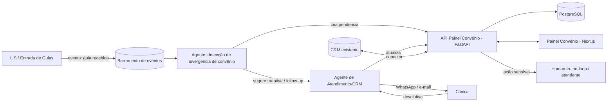
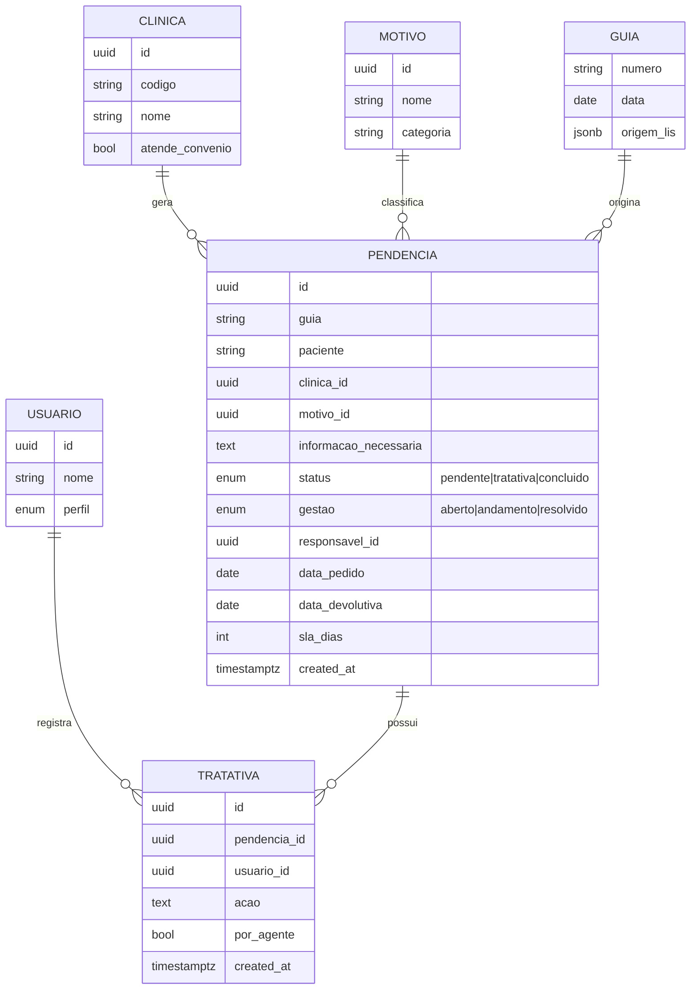

# Painel Convênio — do protótipo ao módulo do ecossistema

> Status: **Escopo técnico** — detalha a evolução do [Painel Convênio](../painel-convenio/README.md)
> (hoje ferramenta client-side) para um **módulo nativo AI-First** do ecossistema Alchemypet.
> Base para dimensionar esforço e custo no orçamento. Alinhado ao
> [Escopo para Orçamento](ESCOPO-ORCAMENTO.md).

---

## 1. Contexto

A gestão de **pendências de convênio** hoje vive em uma planilha (`Pendências Convênio.xlsx`,
53 abas mensais, ~24 mil registros). Uma pendência nasce quando, na entrada de uma guia/exame,
há uma **divergência com o convênio** — exame não lançado, pet não localizado, clínica divergente,
dúvida se é particular, etc. Alguém do atendimento registra, cobra a clínica, recebe a devolutiva
e confirma.

O protótipo atual já transforma essa planilha em painel de indicadores e gestão, mas é
**single-user** (dados no navegador) e depende de **importação manual**. Este documento descreve
como ele vira um módulo do ecossistema — o **primeiro caso concreto** do item
*"planilhas/manual → substituir"* do escopo.

### Mudança-chave

| | Hoje (planilha/protótipo) | Módulo do ecossistema |
|---|---|---|
| Origem da pendência | **digitada** manualmente | **gerada** pelo fluxo de entrada de guias (LIS) + agente de IA |
| Dados | por navegador (isolados) | Postgres compartilhado, ao vivo |
| Tratativa | manual, sem histórico | fluxo com histórico, auditoria e SLA |
| Cobrança à clínica | manual | **agente** dispara e acompanha (WhatsApp/e-mail), human-in-the-loop |
| Acesso | um arquivo | portal com login/perfis |

---

## 2. Encaixe no ecossistema

O módulo consome eventos do core laboratorial e usa a camada de agentes já prevista no escopo.

- **Entrada:** ao receber uma guia, o LIS emite evento; o **agente de detecção** aplica as regras
  de convênio e, havendo divergência, cria a pendência via API (em vez de digitação).
- **Tratativa assistida:** o agente classifica o **motivo** (catálogo padronizado), sugere a
  resposta e pode disparar o follow-up com a clínica pelos canais oficiais. Ações sensíveis
  (confirmar particular, lançar/alterar no convênio) exigem **confirmação humana**.
- **Fechamento:** devolutiva registrada, status atualizado, tudo auditado.

---

## 3. Arquitetura do módulo

Segue a stack recomendada no escopo (§3.1), sem introduzir tecnologia nova.

| Camada | Tecnologia | Responsabilidade |
|---|---|---|
| Frontend | **Next.js + React + TS** | Painel (evolução da UI atual), filtros, tabela, gestão, dashboards |
| Backend | **FastAPI (Python)** | API REST, regras de convênio, orquestração dos agentes, auditoria |
| Banco | **PostgreSQL** | Pendências, tratativas, catálogos, master data de clínicas |
| Busca/IA | **pgvector** | Base de conhecimento das regras de convênio (RAG do agente) |
| Eventos | **barramento** (Redis Streams/RabbitMQ) | Integração desacoplada com LIS/CRM |
| Auth | **provedor de identidade** | Login, perfis (atendente, supervisor, admin), rastreabilidade |
| Canais | **WhatsApp Business API + e-mail** | Follow-up com as clínicas |
| Infra | **Docker + IaC** | Deploy por instância white-label |

---

## 4. Modelo de dados (essencial)

Desenhado a partir dos campos reais da planilha, já **normalizando** o que hoje é texto livre
(a planilha tem ~3.800 variações de nome de clínica e ~2.900 de responsável — vira master data).

Ganhos frente à planilha: **histórico de tratativas** (quem/quando/o quê, humano ou agente),
**master data** de clínicas e motivos (dashboards confiáveis), **SLA** por pendência e
**auditoria** completa.

---

## 5. APIs principais (visão)

- `POST /pendencias` — cria (via agente de detecção ou manual).
- `GET /pendencias` — lista com filtros (período, status, gestão, clínica, responsável, busca).
- `PATCH /pendencias/{id}` — atualiza gestão/status.
- `POST /pendencias/{id}/tratativas` — registra ação (humana ou de agente).
- `POST /pendencias/{id}/followup` — dispara cobrança à clínica (canais oficiais).
- `GET /dashboard` — KPIs e séries agregadas.
- `POST /importar` — ingestão do `.xlsx` histórico (seed/migração).
- `GET /clinicas`, `GET /motivos` — master data.

---

## 6. Regras de convênio (base do agente)

As regras hoje implícitas na cabeça do atendimento viram **conhecimento versionado** (RAG +
tabela de regras), o que permite ao agente classificar e sugerir. Exemplos observados na planilha:

- Exame não lançado no convênio → *ação:* lançar / confirmar com a clínica.
- Pet não localizado no convênio → *ação:* confirmar cadastro/microchip.
- Clínica divergente entre guia e convênio → *ação:* validar clínica correta.
- Exame particular vs. convênio → *ação:* confirmar cobertura.

Cada regra mapeia **motivo → ação sugerida → canal → se exige human-in-the-loop**.

---

## 7. Migração da planilha

1. **Seed histórico:** importar o `.xlsx` atual (o parser do protótipo já normaliza colunas por
   cabeçalho e trata as variações entre abas) → popular `pendencia`/`tratativa`.
2. **Deduplicação/master data:** consolidar clínicas e motivos (fuzzy match nos nomes livres).
3. **Corte:** a partir da virada, novas pendências nascem via evento do LIS; a planilha é aposentada.

O protótipo atual serve de **ponte**: continua útil para consulta/offline enquanto o módulo sobe.

---

## 8. Faseamento e esforço (para o orçamento)

Estimativa em **semanas-desenvolvedor (dev-wk)**, faixas por incluir incertezas de discovery.
Assume a Fundação (Fase 0 do escopo: barramento, IaC, auth) já disponível — senão, somar a ela.

| Entrega | Escopo | Esforço (dev-wk) |
|---|---|---|
| **M1 — Núcleo CRUD + UI** | Banco, API, migração do painel para Next.js consumindo API, auth/perfis, importação do histórico | 4–6 |
| **M2 — Gestão + auditoria + SLA** | Fluxo de tratativas com histórico, master data de clínicas/motivos, dashboards server-side, exportações | 3–4 |
| **M3 — Integração LIS/CRM** | Consumo de eventos de guia, criação automática de pendência, conector CRM | 3–5 |
| **M4 — Agentes de IA** | Detecção de divergência, classificação de motivo, sugestão de tratativa, follow-up WhatsApp/e-mail com human-in-the-loop, RAG das regras | 5–8 |
| **Total do módulo** | | **15–23 dev-wk** |

**Custos recorrentes** (por instância white-label): hospedagem (app + Postgres + storage),
mensageria, **tokens de IA** (proporcional ao volume de pendências/follow-ups) e conta
**WhatsApp Business API** (provedor/BSP).

> Dependências que afetam a estimativa (ver [itens em aberto](ESCOPO-ORCAMENTO.md#7-itens-em-aberto-para-fechar-os-números-do-orçamento)):
> volume de guias/pendências por mês, API disponível no LIS/CRM para os eventos, e o BSP de WhatsApp.

---

## 9. Recomendação de sequência

Entregar **M1 + M2** primeiro dá à equipe uma ferramenta **compartilhada e auditável** já
substituindo a planilha (valor imediato, baixo risco). **M3 + M4** transformam o fluxo em
**AI-first** de fato — a pendência deixa de ser digitada e passa a ser detectada, classificada e
cobrada por agentes, com o humano validando o que é sensível. Esse é o marco em que o módulo vira
vitrine do posicionamento AI-First do produto.
